     

# Crear una api utilizando express y mysql sobre docker

En este pequeño tutorial crearemos una api de usuarios utilizando Nodejs con express en **Ubuntu** 20.04 LTS.
Por razones de entendimiento algunas cosas muy puntuales las dejaré en inglés y me limitaré a dar una explicación breve ya que este tutorial se haría muy extenso.

## Indíce

- [Requisitos](#requisitos)
- [Conocimientos preliminares](#conocimientos-preliminares)
  - [Protocolo HTTP](#protocolo-http)
    - [Tipos de mensaje](#tipos-de-mensaje-http)
    - [Estructura de un mensaje](#estructura-de-un-mensaje-http)
    - [Tipos de métodos](#tipos-de-métodos-http)
    - [Códigos de estado](#códigos-de-estado-http)
  - [JavaScript](#javascript)
    - [Desestructuración](#desestructuración)
    - [Funciones arrow](#funciones-arrow)
    - [Añadir nuevo método a un objeto](#añadir-nuevo-método-a-un-objeto)
  - [Mysql](#mysql)
    - [Insert Set](#insert-set)
    - [SQL Injection](#sql-injection)
  - [Json](#json)
    - [Estructura](#estructura-de-un-json)
    - [JsonAPI](#jsonpi)
- [Dependencias](#dependencias)
  - [Instalación](#instalación-de-dependencias)
  - [Extensiones de vscode](#instalar-extensiones-en-vscode)
- [Iniciando el proyecto](#iniciando-el-proyecto)
- [Mysql](#crear-conexión-mysql-en-vscode)
  - [Crear conexión mysql en vscode](#crear-conexión-mysql-en-vscode)
  - [Crear base de datos](#crear-base-de-datos-y-usuario-en-mysql)
  - [Ejecutar script sql](#ejecutar-script-sql)
  - [Módulo de mysql](#módulo-de-mysql)
- [Index.js](#index.js)
  - [Importación de módulos y declaración de constantes](#1-importación-de-módulos-y-declaración-de-constantes)
  - [Declaración de formato de mensajes de respuesta](#2-declaración-de-formato-de-mensajes-de-respuesta)
  - [Declaración de métodos de comprobación](#3-declaración-de-métodos-de-comprobación)
  - [Manejo de excepciónes de la base de datos](#4-manejo-de-excepciónes-de-la-base-de-datos)
  - [Declaración de métodos HTTP en nuestro servidor](#5-declaración-de-métodos-http-en-nuestro-servidor)
    - [GET](#get)
    - [POST](#post)
    - [PUT](#get)
    - [DELETE](#delete)
  - [Poner en escucha el servidor](#6-poner-en-escucha-el-servidor)
- [Código fuente completo](código-fuente-completo)
- [Poner en marcha nuestro servidor](#poner-en-marcha-nuestro-servidor)
- [Pruebas](#pruebas)
  - [Crear colección en Thunder Client](#crear-colección-en-thunder-client)
    - [GET](#crear-solicitud-get)
    - [POST](#crear-solicitud-post)
    - [PUT](#crear-solicitud-put)
    - [DELETE](#crear-solicitud-delete)
  - [Colección completa de Thunder Client](#colección-completa-de-thunder-client)
  - [Ejecución](#ejecución-de-pruebas)
    - [POST](#ejecución-solicitud-post)
    - [GET](#ejecución-solicitud-get)
    - [PUT](#ejecución-solicitud-put)
    - [DELETE](#ejecución-solicitud-delete)

---

## Requisitos

- Distribución Debian, Ubuntu o derivados
- Conocimientos básicos de operaciones CRUD en mysql
- Conocimientos básicos HTTP/1.1
- Conocimientos básicos de JavaScript (EcmaScript 6)
- Visual studio code

---

## Conocimientos preliminares

TL;DR

Antes de empezar necesitamos tener conocimiento acerca de algunos conceptos claves

---

### Protocolo HTTP

HTTP, de sus siglas en inglés: "Hypertext Transfer Protocol", es el nombre de un protocolo el cual nos permite realizar una petición de datos y recursos, como pueden ser documentos HTML. Es la base de cualquier intercambio de datos en la Web, y un protocolo de estructura cliente-servidor, esto quiere decir que una petición de datos es iniciada por el elemento que recibirá los datos (el cliente)

---

#### Tipos de mensaje HTTP

1. **request** (solicitud en español) es el mensaje que envía el **_cliente_**
2. **response** (respuesta en español) es el mensaje que envía el **_servidor_**

A menudo veremos estos mensajes abreviados como **req** y **res** respectivamente

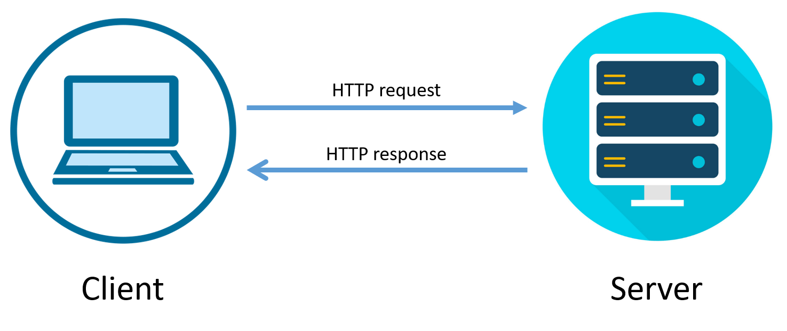

---

#### Estructura de un mensaje HTTP

##### HTTP **request**

Los elementos principales de un mensaje HTTP **request** son

- HTTP HEADER
  - METHOD
  - URI
- HTTP BODY
  - DATA

**Method**: (Método en español) Indica la acción que se desea realizar para un recurso determinado (lo veremos detalladamente en el siguiente punto). e.j _GET_

**URI**: (Identificador Uniforme de Recursos de sus siglas en inglés: Uniform Resource Identifier) es una cadena que se refiere a un recurso. Los más comunes son URLs, que identifican el recurso dando su ubicación en la Web. e.j /_api/usuarios_

**DATA**: (Datos en español) como su nombre lo indica, generalmente los datos enviados se codifican en HTTP BODY, si no hay ningún dato que enviar, es omitido. e.j cuando se envía un formulario HTML POST

##### HTTP **response**

Los elementos principales de un mensaje HTTP **response** son

- HTTP HEADER
  - STATUS CODE
  - CONTENT TYPE
- HTTP BODY
  - DATA

**STATUS CODE**: (Código de estado en español) Indica si se ha completado satisfactoriamente una solicitud (lo veremos detalladamente en el siguiente punto). e.j 200

**CONTENT TYPE**: (Tipo de contenido) Indica el tipo de contenido y codificación que esta enviando el servidor, e.j _text/html; charset=utf8_ indica que es una página web

**DATA**: Son los datos con los que responde el servidor, e.j una página web codificada en _UTF-8_

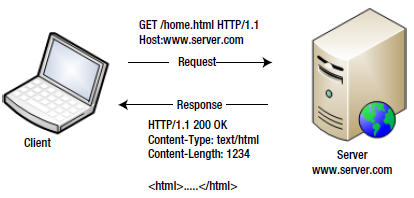

En esta imagen podemos observar que la estructura de los mensajes es la siguiente:

**request**:

- HTTP HEADER
  - METHOD = GET
  - URI = /home.html

**response**:

- HTTP HEADER
  - STATUS CODE = 200
  - CONTENT TYPE = text/html
- HTTP BODY
  - DATA = \<html>....\</html>

---

#### Tipos de métodos HTTP

El tipo de método determinará la acción o la operación CRUD que debemos hacer.

| Método     | Operación SQL | Descripción      |
| ---------- | ------------- | ---------------- |
| **GET**    | SELECT        | Leer datos       |
| **POST**   | INSERT        | Guardar datos    |
| **PUT**    | UPDATE        | Actualizar datos |
| **DELETE** | DELETE        | Eliminar datos   |

---

#### Códigos de estado HTTP

Todo mensaje **response** debe de llevar un código de estado que describa el resultado de la solicitud.

- Respuestas informativas (100–199)
- Respuestas satisfactorias (200–299)
- Redirecciones (300–399)
- Errores de los clientes (400–499)
- y errores de los servidores (500–599)

En este tutorial solo utilizaremos los siguientes

| Código | Nombre                | Descripción                               |
| ------ | --------------------- | ----------------------------------------- |
| 200    | Ok                    | La solicitud tuvo éxito                   |
| 400    | Bad Request           | La solicitud es incorrecta                |
| 404    | Not Found             | El recurso solicitado no existe           |
| 409    | Conflict              | Hay un conflicto al procesar la solicitud |
| 500    | Internal Server Error | Error interno en el servidor              |

---

### JavaScript

#### Desestructuración

La desestructuración es una característica muy conveniente al desarrollar con javascript, es una expresión que nos permite desempaquetar valores de arrays <kbd>[]</kbd> u objetos <kbd>{}</kbd> en grupos de variables, permitiéndonos simplificar y crear código más legible.

Ejemplo 1: No utilizando desestructuración de objetos <kbd>{}</kbd>

```javascript
var usuario = {
  nombre: "Salvador",
  edad: 22,
}

// Debemos acceder a una propiedad por un '.' y el nombre de la propiedad
var nombre = usuario.nombre 
var edad = usuario.edad
console.log(nombre, edad) // Salvador 22
```

Ejemplo 1: Utilizando desestructuración de objetos <kbd>{}</kbd>

Utilizando desestructuración para el anterior bloque de código sería:

```javascript
var usuario = {
  nombre: "Salvador",
  edad: 22,
}

// Las propiedades usuario.nombre y usuario.edad se asignan a las variables correspondientes sin importar su orden
// Debemos acceder a una propiedad por su nombre
var { nombre, edad } = usuario 

console.log(nombre, edad) // Salvador 22
```

Es importante escribir el nombre de la propiedad correctamente respetando las mayúsculas y minúsculas.

```javascript
var usuario = {
  nombre: "Salvador",
  edad: 22,
}

var { Nombre } = usuario

console.log(Nombre) // undefined ya que la propiedad es 'nombre' en minúscula
```

Ejemplo 2: No utilizando desestructuración de array's <kbd>[]</kbd>

```javascript
var usuario1 = {
  nombre: "Salvador",
  edad: 22,
}

var usuario2 = {
  nombre: "Lester",
  edad: 24,
}

var usuario3 = {
  nombre: "Omar",
  edad: 30,
}

var usuarios = [usuario1, usuario2, usuario3]

var u1 = usuarios[0]
var u3 = usuarios[2]

console.log(u1.nombre) // Salvador
console.log(u3.nombre) // Omar
```

Ejemplo 2: Utilizando desestructuración de array's <kbd>[]</kbd>

Utilizando desestructuración para el anterior bloque de código sería:

```javascript
var usuario1 = {
  nombre: "Salvador",
  edad: 22,
}

var usuario2 = {
  nombre: "Lester",
  edad: 24,
}

var usuario3 = {
  nombre: "Omar",
  edad: 30,
}

var usuarios = [usuario1, usuario2, usuario3]

// Los objetos se asignarán utilizando marcadores ',' de posición, aquí si importa el orden.
var [u1, , u3] = usuarios //Como puede observar para omitir un dato simplemente se escribe una ','

console.log(u1.nombre) // Salvador
console.log(u3.nombre) // Omar
```

Puede omitir asignación a una variable hacia la derecha, pero no hacia la izquierda ya que se utiliza un marcador de posición <kbd>,</kbd>

```javascript
var usuario1 = {
  nombre: "Salvador",
  edad: 22,
}

var usuario2 = {
  nombre: "Lester",
  edad: 24,
}

var usuario3 = {
  nombre: "Omar",
  edad: 30,
}

var usuarios = [usuario1, usuario2, usuario3]

var [u1] = usuarios

console.log(u1.nombre) // Salvador

var [u3] = usuarios // No se utiliza el marcador de posición

console.log(u3.nombre) // Salvador, Debería ser Omar!

var [, , u3] = usuarios // Se utiliza el marcador de posición

console.log(u3.nombre) // Omar
```

---

#### Funciones arrow

Con EcmaScript podemos declarar métodos con menos código, utilizando funciones arrow (flecha en inglés ya que su operador es **=>**). e.j

```javascript
var hola = function (nombre) {
  console.log(`Hola ${nombre}!`)
}

var hola = (nombre) => {
  console.log(`Hola ${nombre}!`)
}

// Si la función solo ejecuta una instrucción podemos omitir las llaves
var hola = (nombre) => console.log(`Hola ${nombre}!`)

// Si la función solo recibe un parámetro podemos omitir los paréntesis
var hola = nombre => console.log(`Hola ${nombre}!`)
```

Un dato importante sobre las funciones arrow es que no tienen la referencia this, esto será muy importante para el siguiente punto.

---

#### Añadir nuevo método a un objeto

_Monkey patching_ es una técnica para agregar, modificar o suprimir el comportamiento predeterminado de un fragmento de código en tiempo de ejecución sin cambiar su código fuente original. Esto es similar a [funciones de extension en kotlin](https://devexperto.com/funciones-extension-kotlin-android/)

Siguiendo el ejemplo de nuestra función anterior, debíamos de pasar por parámetro un nombre para imprimirlo:

```javascript
var hola = function (nombre) {
  console.log(`Hola ${nombre}!`)
}

var nombre = "Salvador"

hola(nombre) // Hola Salvador!
```

Sería más simple si podemos definir un nuevo método para los **strings** que haga lo mismo.
Para eso debemos definirlo de la siguiente manera:

```javascript
tipo_de_dato.prototype.nombre_funcion = function () {
  ...
}
```

```javascript
String.prototype.hola = function () {
  console.log(`Hola ${this}!`)
}
// Ahora cualquier string tendrá el método "hola"
// y podremos ahorrar pasar la string como parámetro del método

var nombre = "Salvador"

nombre.hola() //Hola Salador!
```

Si tenemos un objeto de **clave**<kbd>:</kbd>**valor** la palabra reservada **prototype** es omitida, en este caso el tipo de dato es **persona**

```javascript
var persona = {
  nombre: "Salvador",
}

persona.hola = function () {
  console.log(`Hola ${this.nombre}!`)
}

persona.hola() //Hola Salador!
```

---

### Mysql

#### INSERT SET

Probablemente la sintaxis que utilizas para insertar datos en una tabla es la siguiente:

```sql
INSERT INTO usuarios (nombre, apellido, correo) VALUES ("Salvador", "Real","salvador@ejemplo.com")
```

En este tutorial utilizaremos con **SET**

```sql
INSERT INTO usuarios SET nombre="Salvador", apellido="Real", correo="salvador@ejemplo.com"
```

Dado que cuando se envían datos a tráves del protocolo HTTP, se [codifica](#http-request) como **clave**=**valor** y **express** nos devolverá respetando esa sintaxis


Si estamos seguros de recibir los campos correctamente (cantidad de los campos) podemos utilizar la siguiente sintaxis

```javascript
app.use(urlencoded({ extended: false }))

// Obtenemos la misma consulta de arriba
query("INSERT INTO usuarios SET ?", [req.body])
// Pero si nos envían un dato que no esperamos recibir, obtendremos una excepción
// e.j Si nos envían:
// "nombre"  : "Salvador"
// "apellido": "Real"
// "correo"  : "salvador@ejemplo.com"
// "edad"    : 22
// "edad" no es una atributo/columna de nuestra base de datos.
// se ejecutaría la siguiente consulta:
//  INSERT INTO usuarios SET nombre="Salvador", apellido="Real", correo="salvador@ejemplo.com", edad=22
//  Obtendremos la siguiente excepción: "Unknown column 'edad' in 'field list'"
```

Si **no** estamos seguros de recibir los campos correctamente podemos utilizar la siguiente sintaxis

```javascript
app.use(urlencoded({ extended: false }))

const { nombre, apellido, correo } = req.body

// De esta manera solo introduciremos los datos específicos
query("INSERT INTO usuarios SET nombre = ?, apellido = ?, correo = ?", [
  nombre,
  apellido,
  correo,
])
```

Si no entiendes que significa **'?'** lee el siguiente punto.

---

#### SQL Injection

La inyección de SQL es un tipo de ciberataque en el cual un usuario malicioso inserta o "inyecta" código SQL invasor dentro del código SQL programado, con el fin de quebrantar las medidas de seguridad y acceder a datos protegidos.

Por ejemplo tenemos la siguiente consulta SQL elimina un usuario por un ID

```javascript
query("DELETE FROM usuarios WHERE id=" + req.body.id)
```

Ejecutar la consulta de esa manera tiene un gran problema ya que la variable **id** puede tener cualquier valor que es enviado por un usuario. e.j

¿Que pasaría si la variable **id** tuviese el valor "**1**"?

Esta es la consulta que se ejecutaría en la base de datos

```sql
DELETE FROM usuarios WHERE id=1
-- Solo se eliminaría el usuario con id igual a 1
-- Nuestra consulta funciona perfectamente como lo esperado
```

¿Que pasaría si la variable **id** tuviese el valor "**1 or 1 = 1**"?

Esta es la consulta que se ejecutaría en la base de datos

```sql
DELETE FROM usuarios WHERE id=1 or 1 = 1
-- Se inyectó el código 'or 1 = 1'
-- ya que es un or y "1 = 1" siempre es True
-- Se eliminarían todos los registros de la tabla usuario
-- Nuestra consulta no funciona como lo esperado, debído a un comportamiento
-- malintencionado
```

La solución es sencilla. Debemos modificar el código para que cualquier entrada del usuario se escape automáticamente antes de ejecutarse.

Tiene dos opciones para solucionar este problema:

- Marcadores de posición **"?"**

Puede asignar valores en la matriz a marcadores de posición (los signos de interrogación) en el mismo orden en que se pasan.

```javascript
query("DELETE FROM usuarios WHERE id = ?", [req.body.id])

//Por ejemplo que elimine si el id y el nombre concuerdan
query("DELETE FROM usuarios WHERE id = ? AND nombre = ?", [
  req.body.id,
  req.body.nombre,
])
```

- Marcadores de posición con nombre

Esto es casi idéntico al ejemplo anterior, sin embargo, los nombres de los atributos dentro del objeto se convierten en marcadores de posición en la consulta SQL.

```javascript
query("DELETE FROM usuarios WHERE id = :id", { id: req.body.id })

//Por ejemplo que elimine si el id y el nombre concuerdan
query("DELETE FROM usuarios WHERE id = :id AND nombre = :nombre", {
  id: req.body.id,
  nombre: req.body.nombre,
})
```

---

### Json

(JavaScript Object Notation - Notación de Objetos de JavaScript) es un formato ligero de intercambio de datos. Leerlo y escribirlo es simple para humanos, mientras que para las máquinas es simple interpretarlo y generarlo.

---

#### Estructura de un Json

JSON está constituído por dos estructuras:

1. Una colección de pares de nombre/valor. En varios lenguajes esto es conocido como un objeto, registro estructura, diccionario, tabla hash, lista de claves o un arreglo asociativo.

2. Una lista ordenada de valores. En la mayoría de los lenguajes, esto se implementa como arreglos, vectores, listas o sequencias.

Estas son estructuras universales virtualmente todos los lenguajes de programación las soportan de una forma u otra. Es razonable que un formato de intercambio de datos que es independiente del lenguaje de programación se base en estas estructuras.

En JSON, se presentan de estas formas:

Un objeto comienza con <kbd>{</kbd> y termina con <kbd>}</kbd>. Cada nombre es seguido por <kbd>:</kbd> y los pares nombre/valor están separados por <kbd>,</kbd>

Un valor puede ser una cadena de caracteres con comillas dobles, o un número, o true o false o null, o un objeto o un arreglo.

```json
{
  "nombre": "Salvador",
  "apellido": "Real",
  "edad": 22,
  "correo": null,
  "vivo": true
}
```

Un arreglo comienza con <kbd>[</kbd> y termina con <kbd>]</kbd> Los valores se separan por <kbd>,</kbd>

```json
[
  {
    "nombre": "Salvador",
    "apellido": "Real",
    "edad": 22
  },
  {
    "nombre": "Lester",
    "apellido": "Vega",
    "edad": 23
  },
  {
    "nombre": "Omar",
    "apellido": "Rizo",
    "edad": 30
  }
]
```

---

#### JsonApi

Siguiendo el estandar de [JsonApi](https://jsonapi.org/) y tomando de ejemplo la api de [Facebook](https://developers.facebook.com/docs/graph-api/using-graph-api/error-handling/) nuestros mensajes tendrán 2 estructuras principales:

- En caso de **éxito** el formato json será el siguiente

```json
{
  "success": true,
  "status": "success",
  "data": [
    {
      ...
    }
  ]
}
```

**success**: (éxito) es una variable Bolean que indicará si la transacción se ejecutó exitosamente

**status**: (estado) es una variable String que indicará si la transacción se ejecutó exitosamente

**data**: (datos) es un array de Objetos que contendrá los datos devueltos

- En caso de **error** el formato json será el siguiente

```json
{
  "success": false,
  "status": "failed",
  "error": {
    "code": 404,
    "message": "Not found"
  }
}
```

Para los mensajes de error podemos utilizar los [códigos de estado HTTP](#códigos-de-estado-http)

**success**: (éxito) es una variable Bolean que indicará si la transacción se ejecutó exitosamente

**status**: (estado) es una variable String que indicará si la transacción se ejecutó exitosamente

**error**: es un objeto que contendrá el código y mensaje de error

**code**: (código) es una variable numérica que indicará el código de error

**message**:(mensaje) es una variable String que indicará en lenguaje natural la razón del error

---

## Dependencias

1. Git
2. Nodejs
3. npm
4. Docker

---

### Instalación de dependencias

El script se encargara de instalar las dependencias necesarias para el proyecto, en una terminal ejecutar lo siguiente:

```bash
sudo apt install git

git clone https://github.com/srealmoreno/api-express.git

cd api-express

chmod +x build/build.sh

sudo build/build.sh
```

---

### Instalar extensiones en vscode

En visual studio code debes de buscar e instalar las siguientes extensiones

- ms-azuretools.vscode-docker

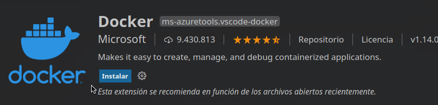

- cweijan.vscode-mysql-client2

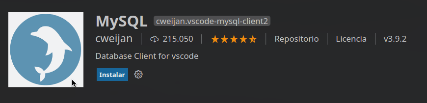

- rangav.vscode-thunder-client

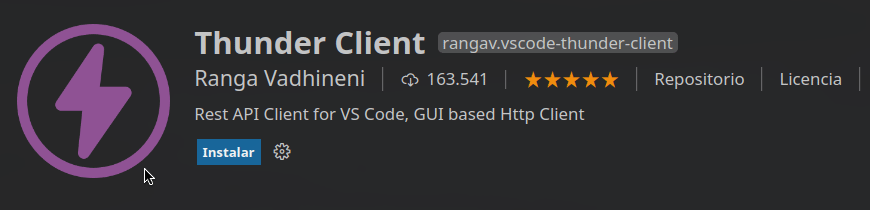

---

Si deseas ahorrarte la creación del código fuente del proyecto, ejecuta esto en la terminal

```bash
git checkout finished

npm install -D
```

Luego sigue solamente estos pasos:

- [Crear conexión mysql en vscode](#crear-conexión-mysql-en-vscode)
- [Ejecutar script.sql](#ejecutar-scriptsql)
- [Poner en marcha nuestro servidor](#poner-en-marcha-nuestro-servidor)
- [Importar Tests Thunder en vscode](#colección-completa-de-thunder-client) (puedes encontrar el archivo en '**tests/thunder_test.json**')
- [Ejecución de Test](#ejecución-de-pruebas)

## Iniciando el proyecto

Debemos inicializar un proyecto utilizando npm, instalar dependencias y crear el archivo **index.js**, en la terminal que tenemos abierta ejecutar lo siguiente:

```bash
npm init -y
npm install express mysql
npm install nodemon -D
touch index.js
```

Modificar el archivo **package.json**, agregar la linea **"start"** y **"dev"**

```json
"scripts": {
    "start": "node index.js",
    "dev": "nodemon node index.js",
    "test": "echo \"Error: no test specified\" && exit 1"
}
```

---

## Comprobar conexión con docker

En el apartado de [docker](#instalar-extensiones-en-vscode) (icono de la ballena) debemos de tener un contenedor **mysql:8.0.25 node-mysql-api** como la siguiente imagen

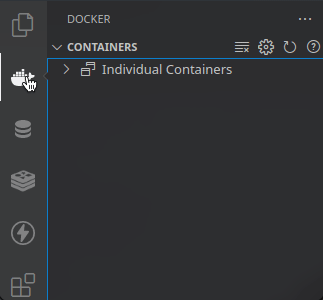

---

## MYSQL

### Crear conexión mysql en vscode

En el apartado de [EXPLORER:DATABASE](#instalar-extensiones-en-vscode) (icono del barril) debemos de crear una nueva conexión con mysql

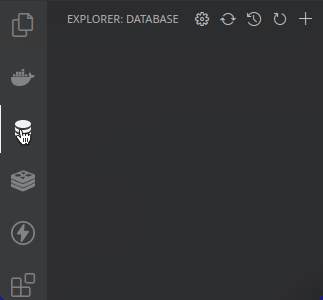

Ingresar rellenar con los siguientes campos:

La contraseña es tu nombre de usuario. e.j: mi nombre de usuario es "**srealmoreno**" entonces la contraseña es **srealmoreno**

|                       |             |
| --------------------- | ----------- |
| **Connection Name**   | mysql_root  |
| **Connection Target** | global      |
| **Database Type**     | mysql       |
| **Host**              | 127.0.0.1   |
| **Port**              | 3306        |
| **Username**          | root        |
| **Password**          | tu usuario  |
| **Databases**         |             |
| **Include Databases** |             |
| **ConnectTimeout**    | 5000        |
| **RequestTimeout**    | 10000       |
| **Timezone**          | +00:00      |
| **SSH Tunnel**        | desactivado |
| **Use SSL**           | desactivado |

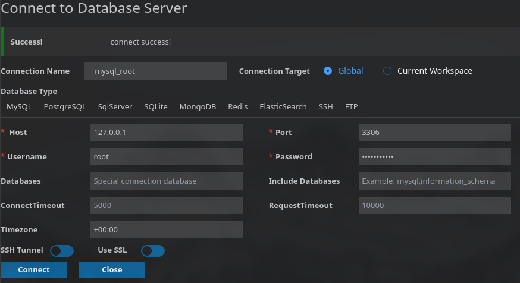

---

### Crear base de datos y usuario en mysql

Debemos crear un script sql, para eso vamos a crear un nuevo fichero llamado 'db.sql'

En este tutorial crearemos una base de datos de usuarios, copia y pega el siguiente código en 'db.sql'

```sql
-- Crear base de datos solo si no existe llamada 'express_api'
CREATE DATABASE IF NOT EXISTS express_api;

-- Usar la base de datos anteriormente creada
USE express_api;

-- Crear tabla si no existe llamada 'usuarios' con los siguientes atributos:
-- 1. 'id' de tipo entero sin signo, que sea una llave primaria   y auto incrementable
-- 2. 'nombre' de tipo varchar con longitud de 30 caracteres   y que no sea NULL
-- 3. 'apellido' de tipo varchar con longitud de 30 caracteres y que no sea NULL
-- 4. 'correo' de tipo varchar con longitud de 40 caracteres
CREATE TABLE IF NOT EXISTS usuarios (
    id INT UNSIGNED AUTO_INCREMENT PRIMARY KEY,
    nombre VARCHAR(30) NOT NULL,
    apellido VARCHAR(30) NOT NULL,
    correo VARCHAR(50)
);

-- Crear Usuario si no existe llamado 'express_api' y que
-- sea accesible desde cualquier parte con contraseña nativa 'express_api'
CREATE USER IF NOT EXISTS 'express_api' @'%' IDENTIFIED WITH mysql_native_password BY 'express_api';

-- Otorgarle permisos totales (CREATE, DROP, DELETE, INSERT, SELECT, UPDATE)
-- al usuario 'express_api' sobre la tabla anteriormente creada 'usuarios'
GRANT ALL PRIVILEGES on usuarios TO 'express_api' @'%';

-- Nota: si deseas utilizar el usuario solo en localhost, cambia
-- el % por la palabra localhost en las dos consultas anteriores

-- Recargar todos los permisos para actualizar el que hemos creado anteriormente
FLUSH PRIVILEGES;
```

---

### Ejecutar script sql

En vscode vamos a presionar las teclas <kbd>Ctrl</kbd> + <kbd>Shift</kbd> + <kbd>P</kbd>, escribiremos **Change active database** y escogeremos <kbd>mysql_root#mysql</kbd>

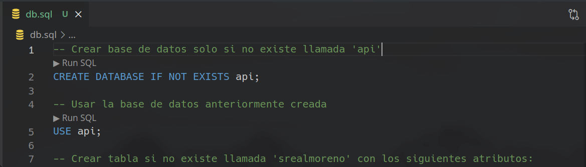

Presionar las las teclas <kbd>Ctrl</kbd> + <kbd>Shift</kbd> + <kbd>Enter</kbd> para ejecutar el script


### Utilizar base de datos creada

Ahora que tenemos la base de datos y el usuario creado, crear nueva conexión con los siguientes valores:

|                       |             |
| --------------------- | ----------- |
| **Connection Name**   | mysql_api   |
| **Connection Target** | global      |
| **Database Type**     | mysql       |
| **Host**              | 127.0.0.1   |
| **Port**              | 3306        |
| **Username**          | express_api |
| **Password**          | express_api |
| **Databases**         |             |
| **Include Databases** | express_api |
| **ConnectTimeout**    | 5000        |
| **RequestTimeout**    | 10000       |
| **Timezone**          | +00:00      |
| **SSH Tunnel**        | desactivado |
| **Use SSL**           | desactivado |

Ahora debemos cambiar la base de datos activa:  
<kbd>Ctrl</kbd> + <kbd>Shift</kbd> + <kbd>P</kbd>, escribiremos **Change active database** y escogeremos <kbd>mysql_api#express_api</kbd>

---

### Módulo de mysql

Vamos a crear un nuevo archivo llamado **db.js** con el siguiente código:

```javascript
const { promisify } = require("util")
const { createPool } = require("mysql")

const credenciales = {
  host: "127.0.0.1",
  user: "express_api",
  password: "express_api",
  database: "express_api"
}

const pool = createPool(credenciales)

pool.queryPromisify = promisify(pool.query)

module.exports = pool
```

> Algunas dudas que quizás tengas:  
> [¿Por qué las variables se declaran con <kbd>{}</kbd>?](#desestructuración)  
> [¿Qué significa **pool.queryPromisify** en el código?](#añadir-nuevo-método-a-un-objeto)  
> [¿Qué es **promisify** en Nodejs?](https://medium.com/@suyashmohan/util-promisify-in-node-js-v8-d07ef4ea8c53)  
> [¿Cúal es la diferencia entre utilizar un pool y una conexión a la base de datos?](https://es.stackoverflow.com/questions/359715/cu%C3%A1l-ser%C3%ADa-la-diferencia-entre-usar-un-pool-o-usar-una-conexion-tradicional-a-l)

---

## Index.js

El archivo index.js es nuestro archivo principal, en este declaramos nuestra API. crea un archivo llamado **index.js** y sigue los siguientes pasos:

---

### 1. Importación de módulos y declaración de constantes

- Importamos el módulo de express y [nuestro módulo](#módulo-de-mysql) de la conexión a la base de datos.  
- Declaramos una dirección **IP** y un **Puerto** donde estará escuchando nuestra aplicación.  
- Indicarle a express que decodifique los datos que nos envían a través de una [solicitud HTTP](#protocolo-http)

Agrega el siguiente código al archivo **index.js**

```javascript
const express = require("express")
const database = require("./db.js")
const { urlencoded, json } = express
const app = express()

const IP = "127.0.0.1"
const PORT = 3000

app.use(urlencoded({ extended: false }))
app.use(json())
```

> Algunas dudas que quizás tengas:  
> [¿Por qué las variables se declaran con <kbd>{}</kbd>?](#desestructuración)  
> [¿Que significa **urlencoded()** y **json()**?](#insert-set)

---

### 2. Declaración de formato de mensajes de respuesta

- Declaramos 2 [nuevos métodos](#añadir-nuevo-método-a-un-objeto) para los objetos de tipo **response** que enviarán un [JSON](#json) con la estructura de nuestros mensajes

- Para el caso de [**éxito**](#jsonapi)

Agrega el siguiente código al archivo **index.js**

```javascript
express.response.sendMessage = function (data = undefined) {
    const body = {
        success: true,
        status: "success"
    }

    if (data !== undefined)
        body["data"] = data

    this.status(200).json(body)
}
```

- Para el caso de [**error**](#jsonapi)

Agrega el siguiente código al archivo **index.js**

```javascript
express.response.sendError = function (code, message) {
    const body = {
        success: false,
        status: "failed",
        error: {
            code: code,
            message: message
        }
    }

    this.status(code).json(body)
}
```

> Algunas dudas que quizás tengas:  
> [¿Que significa **response**?](#tipos-de-mensaje-http)  
> [¿Que significa **status()**?](#códigos-de-estado-http)

---

### 3. Declaración de métodos de comprobación

- Declaramos un [nuevo método](#añadir-nuevo-método-a-un-objeto) para los objetos de tipo **request** que comprobarán si los [datos](#http-request) que nos envían a través de un [POST](#tipos-de-métodos-http) o [PUT](#tipos-de-métodos-http) están vacíos

Agrega el siguiente código al archivo **index.js**

```javascript
express.request.isBodyEmpty = function () {
    return Object.keys(this.body).length === 0
}
```

> Algunas dudas que quizás tengas:  
> [¿Que significa **response**?](#tipos-de-mensaje-http)  

---

### 4. Manejo de excepciónes de la base de datos

- Declaramos un objeto **mysqlErrors** que contiene un método para manejar una excepción especifica.

Agrega el siguiente código al archivo **index.js**

```javascript
const mysqlErrors = {
    ER_NO_DEFAULT_FOR_FIELD: (res, errorMessage) => {
        res.sendError(400, "Bad request, " + errorMessage)
    },

    ER_BAD_FIELD_ERROR: (res, errorMessage) => {
        res.sendError(400, "Bad request, " + errorMessage)
    },

    ER_DUP_ENTRY: (res, errorMessage) => {
        res.sendError(409, "Conflict, " + errorMessage)
    }
}
```

| Error | Descripción |
| --- | --- |
| **ER_NO_DEFAULT_FOR_FIELD**| Este error ocurre cuando **omitimos** un campo y este está declarado como **NOT NULL** y además **NO** tiene un valor por defecto |
| **ER_BAD_FIELD_ERROR**| Este error ocurre cuando se desea **asignar** un campo **desconocido** a una tabla
| **ER_DUP_ENTRY**| Este error ocurre cuando se desea **actualizar** un **ID único** y otro registro ya lo tiene asignado

---

### 5. Declaración de métodos HTTP en nuestro servidor

Para declarar los [métodos HTTP](#tipos-de-métodos-http) debemos de especificarlo con un <kbd>.</kbd> seguido de el tipo de método.  

Cada [método HTTP](#tipos-de-métodos-http) debe de tener 2 argumentos:

1. **string**: Path [URI](#http-request)
2. **método**: Manejador del método HTTP [arrow Functions](#funciones-arrow)

Todo manejador (handler) recibirá por lo menos 2 argumentos:

1. **req** Un Objeto de tipo _express.[request](#tipos-de-mensaje-http)_
2. **res** Un Objeto de tipo _express.[request](#tipos-de-mensaje-http)_

Para acceder a las variables de los Objetos tipo request tenemos 3 maneras diferentes.

| Manera        | Descripción                | Método HTTP | Ejemplo                                      |
| ------------- | -------------------------- | ----------- | -------------------------------------------- |
| req.body.id   | Variable en los datos HTTP | POST\|PUT   | Enviar un formulario HTML con el método POST |
| req.query.id  | Variable en la URL         | ANY         | /api/usuario?id=1                            |
| req.params.id | Variable en la URI         | ANY         | /api/usuario/:id                             |

Nuestra [URI](#http-request) será **"/api/usuarios"**

---

#### [GET](#tipos-de-métodos-http)

Agrega el siguiente código al archivo **index.js**

```javascript
// Obtener todos los usuarios
app.get("/api/usuarios", async (req, res) => {

    console.log("Obtener todos los usuarios")

    try {
        const usuarios = await database.queryPromisify("SELECT * FROM usuarios")

        if (usuarios.length === 0)
            return res.sendError(404, "Empty list")

        return res.sendMessage(usuarios)

    } catch (error) {
        console.error(error)

        return res.sendError(500, "Internal Server Error, " + error.message)
    }
})

// Obtener usuario por un ID pasado por la URL (req.params)
app.get("/api/usuarios/:id", async (req, res) => {
    console.log("Obtener usuario por id " + req.params.id)

    try {
        const usuario = await database.queryPromisify(
            "SELECT * FROM usuarios WHERE id = ?", [req.params.id]
        )

<<<<<<< HEAD
        if (usuario.length === 0)
=======
        if (usuario ==  undefined)
>>>>>>> 9c23d34... Mejorando tutorial
            return res.sendError(404, "Not found")

        return res.sendMessage(usuario)
    } catch (error) {
        console.error(error)

        return res.sendError(500, "Internal Server Error, " + error.message)
    }
})
```

> Algunas dudas que quizás tengas:  
> [¿Que significa **res** y **req**?](#5-declaración-de-métodos-http-en-nuestro-servidor)  
> [¿Qué significa **aync** y **await** en el código?](http://farzicoder.com/util-promisify-in-Node-js-v8/#Async-amp-Await)  
> [¿Qué significa **?** y el array en la consulta?](#sql-injection)

---

#### [POST](#tipos-de-métodos-http)

Agrega el siguiente código al archivo **index.js**

```javascript
// Guardar un nuevo usuario (req.body)
app.post("/api/usuarios", async (req, res) => {

    console.log("Guardar un nuevo usuario")

    if (req.isBodyEmpty())
        return res.sendError(400, "Bad request, empty data")

    try {
        await database.queryPromisify("INSERT INTO usuarios SET ?", [req.body])

        return res.sendMessage()
    } catch (error) {
        console.error(error)

        if (mysqlErrors[error.code])
            return mysqlErrors[error.code](res, error.message)
        else
            return res.sendError(500, "Internal Server Error, " + error.message)
    }
})
```

**error.code**: es un String, es el **nombre del error**  
Comprobamos si el error **existe** en nuestro objeto mysqlErrors. **Si existe**, **ejecutamos** el método asociado a ese error. **Si no existe**, enviamos el error "Internal Server Error"

> Algunas dudas que quizás tengas:  
> [¿Que significa **res** y **req**?](#5-declaración-de-métodos-http-en-nuestro-servidor)  
> [¿Qué significa **aync** y **await** en el código?](http://farzicoder.com/util-promisify-in-Node-js-v8/#Async-amp-Await)  
> [¿Qué significa **SET** en la consulta?](#insert-set)  
> [¿Qué significa **?** y el array en la consulta?](#sql-injection)

---

#### [PUT](#tipos-de-métodos-http)

Agrega el siguiente código al archivo **index.js**

```javascript
// Actualizar usuario por un ID pasado por la URL
app.put("/api/usuarios/:id", async (req, res) => {

    console.log("Actualizar usuario por id " + req.params.id)

    if (req.isBodyEmpty())
        return res.sendError(400, "Bad request, empty data")

    try {

        const { affectedRows } = await database.queryPromisify(
            "UPDATE usuarios SET ? WHERE id = ?", [req.body, req.params.id]
        )

        if (affectedRows !== 0)
            return res.sendMessage()
        else
            return res.sendError(404, "Not found")

    } catch (error) {
        console.error(error)

        if (mysqlErrors[error.code])
            return mysqlErrors[error.code](res, error.message)
        else
            return res.sendError(500, "Internal Server Error, " + error.message)
    }
})
```

**affectedRows**: (Filas afectadas) es un Int que nos indicará la cantidad de registros que fueron **actualizados**.  
Si esa variable es **igual a _0_**, quiere decir que **no existe** ningún registro con el ID pasado por parámetro.

**error.code**: es un String, es el **nombre del error**  
Comprobamos si el error **existe** en nuestro objeto mysqlErrors. **Si existe**, **ejecutamos** el método asociado a ese error. **Si no existe**, enviamos el error "Internal Server Error"

> Algunas dudas que quizás tengas:  
> [¿Que significa **res** y **req**?](#5-declaración-de-métodos-http-en-nuestro-servidor)  
> [¿Por qué la variable **affectedRows** se declara entre <kbd>{}</kbd>?](#desestructuración)  
> [¿Qué significa **aync** y **await** en el código?](http://farzicoder.com/util-promisify-in-Node-js-v8/#Async-amp-Await)  
> [¿Qué significa **SET** en la consulta?](#insert-set)  
> [¿Qué significa **?** y el array en la consulta?](#sql-injection)

---

#### [DELETE](#tipos-de-métodos-http)

Agrega el siguiente código al archivo **index.js**

```javascript
// Eliminar un usuario por un ID pasado por la URL (req.params)
app.delete("/api/usuarios/:id", async (req, res) => {

    console.log("Eliminar usuario por id " + req.params.id)

    try {

        const { affectedRows } = await database.queryPromisify(
            "DELETE FROM usuarios WHERE id = ?", [req.params.id]
        )

        if (affectedRows !== 0)
            return res.sendMessage()
        else
            return res.sendError(404, "Not found")

    } catch (error) {
        console.error(error)

        return res.sendError(500, "Internal Server Error, " + error.message)
    }
})
```

**affectedRows**: (Filas afectadas) es un Int que nos indicará la cantidad de registros que fueron **eliminados**.  
Si esa variable es **igual a _0_**, quiere decir que **no existe** ningún registro con el ID pasado por parámetro.

> Algunas dudas que quizás tengas:  
> [¿Que significa **res** y **req**?](#5-declaración-de-métodos-http-en-nuestro-servidor)  
> [¿Por qué la variable **affectedRows** se declara entre <kbd>{}</kbd>?](#desestructuración)  
> [¿Qué significa **aync** y **await** en el código?](http://farzicoder.com/util-promisify-in-Node-js-v8/#Async-amp-Await)  
> [¿Qué significa **SET** en la consulta?](#insert-set)  
> [¿Qué significa **?** y el array en la consulta?](#sql-injection)

---

### 6. Poner en escucha el servidor

Debemos de indicarle al servidor que este en modo listening en el puerto y dirección ip declarada en el paso 1

Agrega el siguiente código al archivo **index.js**

```javascript
app.listen(PORT, IP, ()=> console.log(`Listening in http://${IP}:${PORT}`))
```

---

## Código fuente completo

Package json: [package.json](https://github.com/srealmoreno/api-express/raw/finished/package.json)  
Script sql: [db.sql](https://github.com/srealmoreno/api-express/raw/finished/db.sql)  
Módulo de la base de datos: [db.js](https://github.com/srealmoreno/api-express/raw/finished/db.js)  
Archivo principal: [index.js](https://github.com/srealmoreno/api-express/raw/finished/index.js)  

---

## Poner en marcha nuestro servidor

En vscode vamos a presionar las teclas <kbd>Ctrl</kbd> + <kbd>Shift</kbd> + <kbd>P</kbd>, luego escribir 'Alternar Terminal'

Ejecutamos lo siguiente en la terminal:

```bash
node start
```

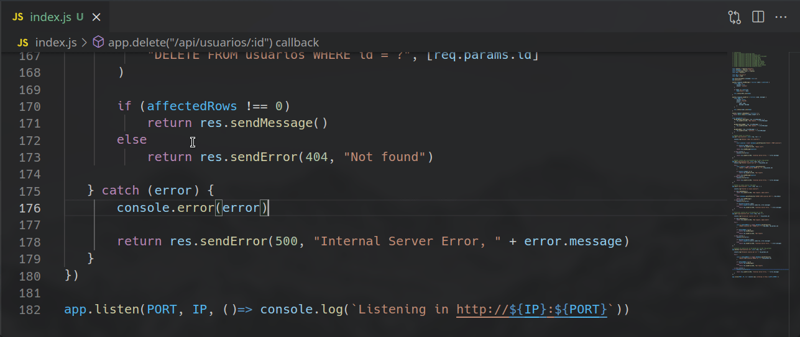

Si deseamos que nuestro servidor se reinicie automáticamente cada vez que modifiquemos cualquier fichero del proyecto ejecutamos

```bash
node run dev
```

Si podemos ver el texto 'Listening in [http://127.0.0.1:3000](##)' quiere decir que nuestro servidor inició correctamente.

Ahora debemos ocultar la terminal haciendo click en el botón <kbd>X</kbd>

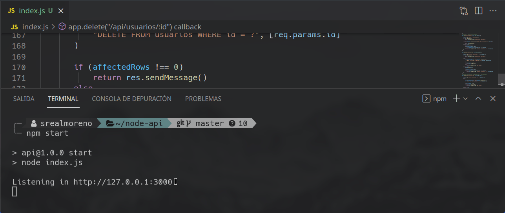

---

## Pruebas

Ahora que tenemos nuestro servidor en funcionamiento debemos hacer unas pruebas.  

---

### Crear colección en Thunder Client

Una colección es un grupo de solicitudes.  
En el apartado de [Thunder Client](#instalar-extensiones-en-vscode) (icono de rayo) debemos crear una nueva colección con nombre **Test node-api**

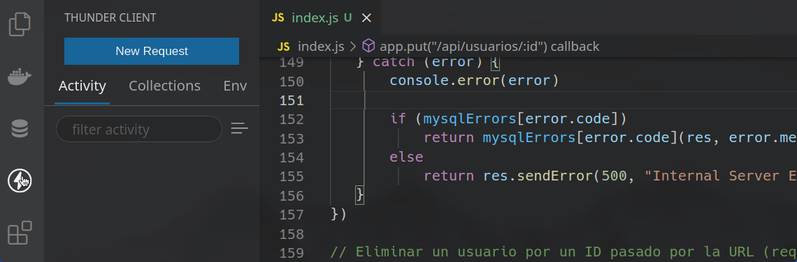

---

#### Crear solicitud GET

En nuestra colección crearemos un nuevo request con nombre **Obtener Usuarios**

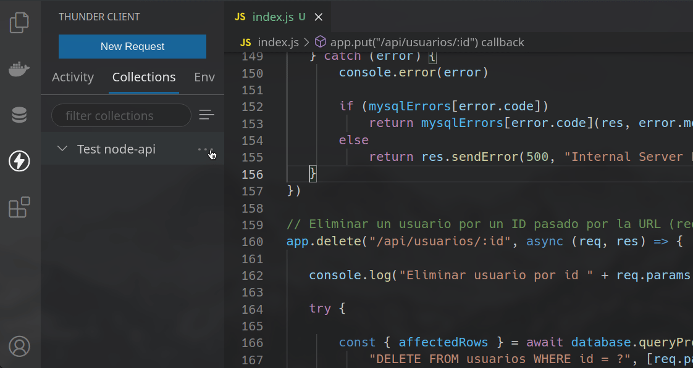

Rellena con los siguientes datos:

|            |                                          |
| ---------- | ---------------------------------------- |
| **url**    | [http://127.0.0.1:3000/api/usuarios](##) |
| **Método** | <kbd>GET</kbd>                           |

En la pestaña de <kbd>Headers</kbd> rellena con los siguientes datos:

|            |                             |
| ---------  | --------------------------- |
| **Accept** | <kbd>application/json</kbd> |

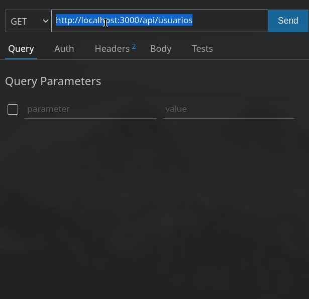

En la pestaña de <kbd>Tests</kbd> rellena con los siguientes datos:

|                         |                  |                                 |
| ----------------------- | ---------------- | ------------------------------- |
| <kbd>ResponseCode</kbd> | <kbd>Equal</kbd> | 200                             |
| <kbd>ContentType</kbd>  | <kbd>Equal</kbd> | application/json; charset=utf-8 |
| json.success            | <kbd>Equal</kbd> | true                            |
| json.status             | <kbd>Equal</kbd> | sucess                          |

y por último <kbd>Ctrl</kbd> + <kbd>S</kbd> para guardar

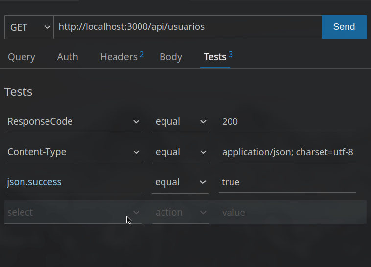

> Algunas dudas que quizás tengas:  
> [¿Que es <kbd>ResponseCode</kbd>?](#http-response)  
> [¿Que es <kbd>ContentType</kbd>?](#http-response)  
> [¿Qué es json.success y json.status?](##2-declaración-de-formato-de-mensajes-de-respuesta)  

---

#### Crear solicitud POST

Duplica el request anterior y cambiale el nombre a **Guardar Usuario**
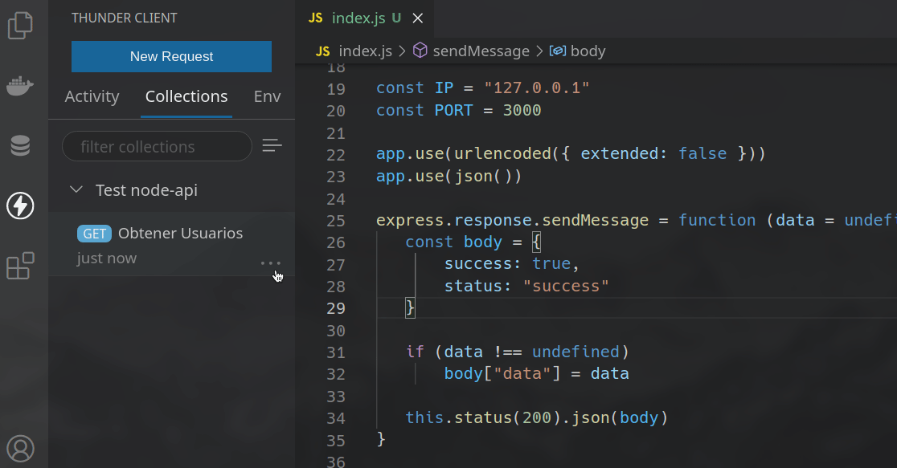

Rellena con los siguientes datos:

|            |                  |
| ---------- | ---------------- |
| **Método** | <kbd>POST</kbd>  |

En la pestaña de <kbd>Body</kbd>, escogeremos la opción <kbd>Form-encodec</kbd> y rellena con los siguientes datos:

|              |               |
| ------------ | ------------- |
| **nombre**   | _Tu nombre_   |
| **apellido** | _Tu apellido_ |
| **correo**   | _Tu correo_   |

y por último <kbd>Ctrl</kbd> + <kbd>S</kbd> para guardar


---

#### Crear solicitud PUT

Duplica el request **Guardar Usuario** y cambiale el nombre a **Actualizar Usuario**

Rellena con los siguientes datos:

Recuerda que en este método debemos de [indicarle el ID por la URL](#put) en este caso el ID será: **1**

|            |                                            |
| ---------- | ------------------------------------------ |
| **url**    | [http://127.0.0.1:3000/api/usuarios/1](##) |
| **Método** | <kbd>PUT</kbd>                            |

En la pestaña de <kbd>Body</kbd>, escogeremos la opción <kbd>Form-encodec</kbd> y rellena con los siguientes datos:

|              |                 |
| ------------ | --------------- |
| **nombre**   | _Otro nombre_   |
| **apellido** | _Otro apellido_ |
| **correo**   | _Otro correo_   |

y por último <kbd>Ctrl</kbd> + <kbd>S</kbd> para guardar

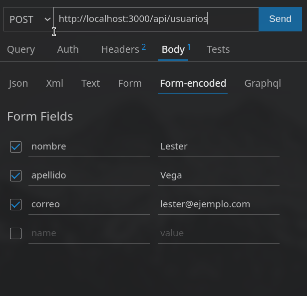

---

#### Crear solicitud DELETE

Duplica el request **Obtener Usuarios** y cambiale el nombre a **Eliminar Usuario**
Para tener un orden arrastras el request con el mouse de la siguiente manera:

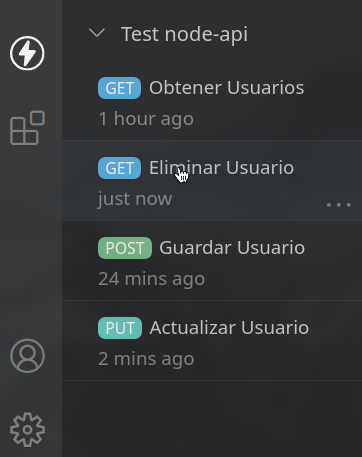

Rellena con los siguientes datos:

Recuerda que en este método debemos de [indicarle el ID por la URL](#delete) en este caso el ID será: **1**

|            |                                            |
| ---------- | ------------------------------------------ |
| **url**    | [http://127.0.0.1:3000/api/usuarios/1](##) |
| **Método** | <kbd>DELETE</kbd>                          |

y por último <kbd>Ctrl</kbd> + <kbd>S</kbd> para guardar

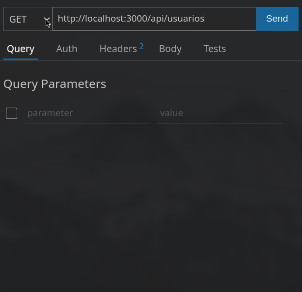

---

Al final debería verse así:

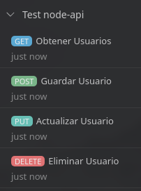

---

### Colección completa de Thunder Client

También puedes [descargar](tests/thunder_test.json) e importar la colección que hicimos en el paso anterior

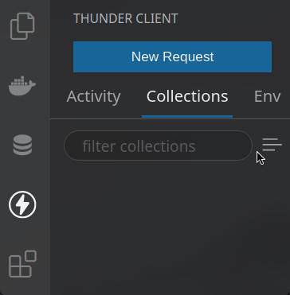

### Ejecución de pruebas

Para la ejecución de las pruebas es simple solo debemos ir a cada una de las solicitudes y hacer click en el botón <kbd>Send</kbd>

Cuando ejecutemos las pruebas tendremos 2 pestañas importantes:

<kbd>Response</kbd>: Es el Json con que responderá el servidor

<kbd>Test Results</kbd>: Serán el resultado de las pruebas, debemos obtener <kbd>Pass</kbd> en el resultado de cada prueba

Para no obtener el [error "Empty List"](#get) primero vamos a guardar un nuevo usuario.

---

#### Ejecución solicitud POST

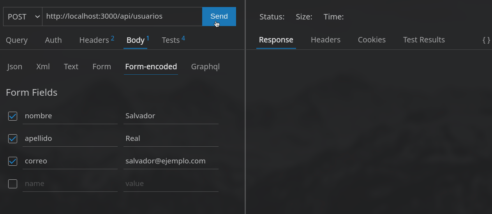

---

#### Ejecución solicitud GET

Aquí veremos el usuario que se guardo en el test anterior

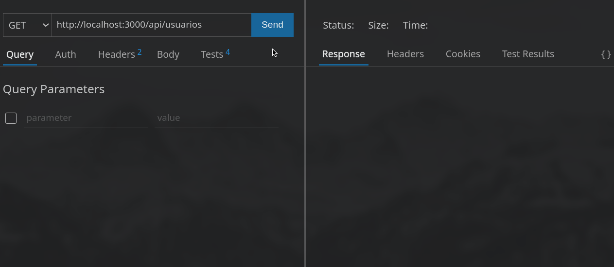

---

#### Ejecución solicitud PUT

Aquí modificaremos el usuario que se guardó

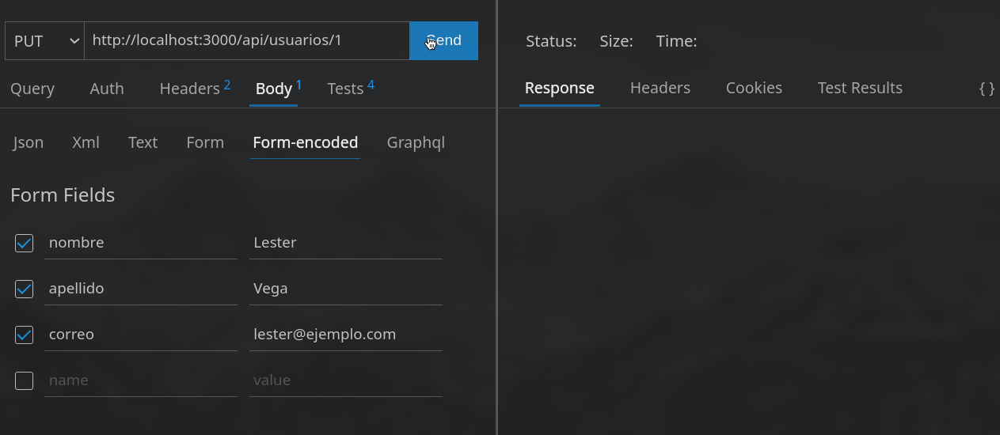

Para comprobarlo podemos a volver a ejecutar la [primer prueba](#ejecución-solicitud-get)

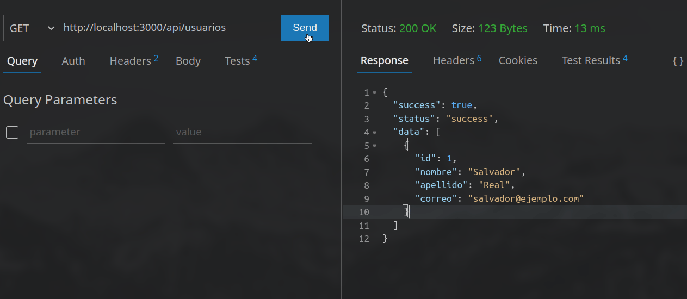

---

#### Ejecución solicitud DELETE

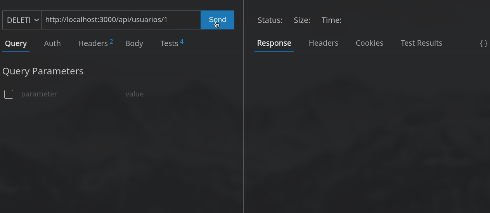

---

## Wiki

HTTP:

[HTTP Messages and Structure](https://developer.mozilla.org/es/docs/Web/HTTP/Messages)  
[HTTP Request Methods](https://developer.mozilla.org/en-US/docs/Web/HTTP/Methods)  
[HTTP Status Codes](https://developer.mozilla.org/en-US/docs/Web/HTTP/Status)  

JavaScript:

[Destructuring assignment](https://developer.mozilla.org/en-US/docs/Web/JavaScript/Reference/Operators/Destructuring_assignment)  
[Arrow Functions](https://developer.mozilla.org/en-US/docs/Web/JavaScript/Reference/Functions/Arrow_functions)  
[Monkey patch](https://en.wikipedia.org/wiki/Monkey_patch)

Base de datos:

[Express mysql](https://expressjs.com/es/guide/database-integration.html#mysql)  
[Pool Connection](https://es.wikipedia.org/wiki/Connection_pool)  
[Mysql pool](https://github.com/mysqljs/mysql#pooling-connections)  
[Promisify in Node](https://medium.com/@suyashmohan/util-promisify-in-node-js-v8-d07ef4ea8c53)  
[Mysql error codes](https://github.com/sambrmg/mysql-error-codes)  
[Sql Injection](https://en.wikipedia.org/wiki/SQL_injection)  
[Sql Injection in Nodejs](https://www.veracode.com/blog/secure-development/how-prevent-sql-injection-nodejs)

Json:

[Structure of Json](https://www.json.org/json-en.html)  
[JsonAPI](https://jsonapi.org/)  

Docker:

[Install](https://docs.docker.com/engine/install/linux/)  
[Docker Pull](https://docs.docker.com/engine/reference/commandline/pull/)  
[Docker Image](https://docs.docker.com/engine/reference/commandline/image/)  
[Docker Run](https://docs.docker.com/engine/reference/commandline/run/)  
[Docker Start](https://docs.docker.com/engine/reference/commandline/start/)  
[Docker Stop](https://docs.docker.com/engine/reference/commandline/stop/)  
[Docker mysql](https://hub.docker.com/_/mysql)

Express:

[Express api](https://expressjs.com/en/api.html)  
[Express json](https://expressjs.com/en/api.html#res.json)  
[Express urlencoded](https://expressjs.com/en/api.html#express.urlencoded)  
[Express request body](https://expressjs.com/en/api.html#req.body)  
[Express request query](https://expressjs.com/en/api.html#req.query)  
[Express request param](https://expressjs.com/en/api.html#app.param)  
[Express GET Method](https://expressjs.com/en/api.html#app.get.method)  
[Express POST Method](https://expressjs.com/en/api.html#app.post.method)  
[Express PUT Method](https://expressjs.com/en/api.html#app.put.method)  
[Express DELETE Method](https://expressjs.com/en/api.html#app.delete.method)  
[Express Response Status](https://expressjs.com/en/api.html#res.status)  

Extensiones vscode:

[Docker](https://github.com/microsoft/vscode-docker)  
[Database Client](https://github.com/cweijan/vscode-database-client)  
[Thunder Client](https://github.com/rangav/thunder-client-support)  

---

## Autor

|  |  [srealmoreno](https://github.com/srealmoreno) |
| :---: | :--: |

También puedes mirar la lista de todos los [contribuyentes](https://github.com/srealmoreno/api-express/contributors) quíenes han participado en este proyecto.

---

## Licencia

Este proyecto está bajo la Licencia GNU General Public License v3.0 - mira el archivo [LICENSE.md](LICENSE.md) para más detalles

---
