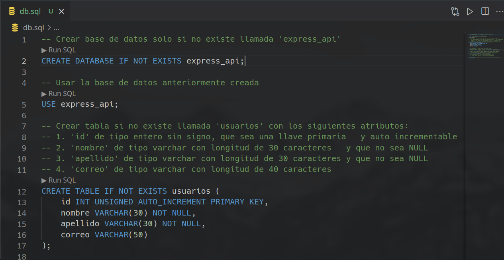

     

# Crear una api utilizando express y mysql sobre docker

En este pequeño tutorial crearemos una api de usuarios utilizando Nodejs con express en **Ubuntu** 20.04 LTS.
Por razones de entendimiento algunas cosas muy puntuales las dejaré en inglés y me limitaré a dar una explicación breve ya que este tutorial se haría muy extenso.

## Indíce

- [Conocimientos preliminares](#conocimientos-preliminares)
- [Requisitos](#requisitos)
- [Dependencias](#dependencias)
  - [Instalación](#instalación-de-dependencias)
  - [Extensiones de vscode](#instalar-extensiones-en-vscode)
- [Mysql](#mysql)
  - [Crear conexión mysql en vscode](#crear-conexión-mysql-en-vscode)
  - [Ejecutar script sql](#ejecutar-script-sql)
- [Poner en marcha nuestro servidor](#poner-en-marcha-nuestro-servidor)
- [Pruebas](#pruebas)
  - [Importar colección a Thunder Client](#colección-completa-de-thunder-client)
  - [Ejecución](#ejecución-de-pruebas)
    - [POST](#ejecución-solicitud-post)
    - [GET](#ejecución-solicitud-get)
    - [PUT](#ejecución-solicitud-put)
    - [DELETE](#ejecución-solicitud-delete)

---

## Conocimientos preliminares

Necesitamos tener conocimientos acerca de algunos conceptos claves que utilizaremos en este proyecto:

Si tienes conocimientos de estos temas, puedes omitir la lectura.

- [Protocolo HTTP](https://github.com/srealmoreno/api-express/wiki/Conocimientos-preliminares#protocolo-http)
- [JavaScript](https://github.com/srealmoreno/api-express/wiki/Conocimientos-preliminares#javascript)
- [Mysql](https://github.com/srealmoreno/api-express/wiki/Conocimientos-preliminares#mysql)
- [Json](https://github.com/srealmoreno/api-express/wiki/Conocimientos-preliminares#json)

Puedes leerlos en la [WIKI](https://github.com/srealmoreno/api-express/wiki/Conocimientos-preliminares) del proyecto

---

## Requisitos

- Distribución Debian, Ubuntu o derivados
- Conocimientos básicos de operaciones CRUD en mysql
- Conocimientos básicos HTTP/1.1
- Conocimientos básicos de JavaScript (EcmaScript 6)
- Visual studio code

---

## Dependencias

1. Git
2. Nodejs
3. npm
4. Docker

---

### Instalación de dependencias

El script se encargara de instalar las dependencias necesarias para el proyecto, en una terminal ejecutar lo siguiente:

```bash
sudo apt install git

git clone https://github.com/srealmoreno/api-express.git

cd api-express

git checkout finished

chmod +x build/build.sh

sudo build/build.sh

npm install

code .
```

---

### Instalar extensiones en vscode

En visual studio code debes de buscar e instalar las siguientes extensiones

- ms-azuretools.vscode-docker


- cweijan.vscode-mysql-client2


- rangav.vscode-thunder-client


---

## Comprobar conexión con docker

En el apartado de [docker](#instalar-extensiones-en-vscode) (icono de la ballena) debemos de tener un contenedor **mysql:8.0.25 node-mysql-api** como la siguiente imagen


---

## Mysql

### Crear conexión mysql en vscode

En el apartado de [EXPLORER:DATABASE](#instalar-extensiones-en-vscode) (icono del barril) debemos de crear una nueva conexión con mysql


Ingresar rellenar con los siguientes campos:

La contraseña es tu nombre de usuario. e.j: mi nombre de usuario es "**srealmoreno**" entonces la contraseña es **srealmoreno**

|                       |             |
| --------------------- | ----------- |
| **Connection Name**   | mysql_root  |
| **Connection Target** | global      |
| **Database Type**     | mysql       |
| **Host**              | 127.0.0.1   |
| **Port**              | 3306        |
| **Username**          | root        |
| **Password**          | tu usuario  |
| **Databases**         |             |
| **Include Databases** |             |
| **ConnectTimeout**    | 5000        |
| **RequestTimeout**    | 10000       |
| **Timezone**          | +00:00      |
| **SSH Tunnel**        | desactivado |
| **Use SSL**           | desactivado |


---

### Ejecutar script sql

Abre el archivo **db.sql**

En vscode vamos a presionar las teclas <kbd>Ctrl</kbd> + <kbd>Shift</kbd> + <kbd>P</kbd>, escribiremos **Change active database** y escogeremos <kbd>mysql_root#mysql</kbd>


Presionar las las teclas <kbd>Ctrl</kbd> + <kbd>Shift</kbd> + <kbd>Enter</kbd> para ejecutar el script



### Utilizar base de datos creada

Ahora que tenemos la base de datos y el usuario creado, crear nueva conexión con los siguientes valores:

|                       |             |
| --------------------- | ----------- |
| **Connection Name**   | mysql_api   |
| **Connection Target** | global      |
| **Database Type**     | mysql       |
| **Host**              | 127.0.0.1   |
| **Port**              | 3306        |
| **Username**          | express_api |
| **Password**          | express_api |
| **Databases**         |             |
| **Include Databases** | express_api |
| **ConnectTimeout**    | 5000        |
| **RequestTimeout**    | 10000       |
| **Timezone**          | +00:00      |
| **SSH Tunnel**        | desactivado |
| **Use SSL**           | desactivado |

Ahora debemos cambiar la base de datos activa:  
<kbd>Ctrl</kbd> + <kbd>Shift</kbd> + <kbd>P</kbd>, escribiremos **Change active database** y escogeremos <kbd>mysql_api#express_api</kbd>

---

## Poner en marcha nuestro servidor

Abre el archivo **index.js**

En vscode vamos a presionar las teclas <kbd>Ctrl</kbd> + <kbd>Shift</kbd> + <kbd>P</kbd>, luego escribir 'Alternar Terminal'

Ejecutamos lo siguiente en la terminal:

```bash
npm start
```


Si deseamos que nuestro servidor se reinicie automáticamente cada vez que modifiquemos cualquier archivo del proyecto ejecutamos

```bash
npm run dev
```

Si podemos ver el texto 'Listening in [http://127.0.0.1:3000](##)' quiere decir que nuestro servidor inició correctamente.

Ahora debemos ocultar la terminal haciendo click en el botón <kbd>X</kbd>


---

## Pruebas

Ahora que tenemos nuestro servidor en funcionamiento debemos hacer unas pruebas.  

---

### Colección completa de Thunder Client

Debes importar la colección a thunder-client puedes encontrarla en '**tests/thunder_test.json**'


Debería de verse así:


### Ejecución de pruebas

Para la ejecución de las pruebas es simple solo debemos ir a cada una de las solicitudes y hacer click en el botón <kbd>Send</kbd>

Cuando ejecutemos las pruebas tendremos 2 pestañas importantes:

<kbd>Response</kbd>: Es el Json con que responderá el servidor

<kbd>Test Results</kbd>: Serán el resultado de las pruebas, debemos obtener <kbd>Pass</kbd> en el resultado de cada prueba

Para no obtener el [error "Empty List"](#get) primero vamos a guardar un nuevo usuario.

---

#### Ejecución solicitud POST


---

#### Ejecución solicitud GET

Aquí veremos el usuario que se guardo en el test anterior


---

#### Ejecución solicitud PUT

Aquí modificaremos el usuario que se guardó


Para comprobarlo podemos a volver a ejecutar la [primer prueba](#ejecución-solicitud-get)


---

#### Ejecución solicitud DELETE


---

## Wiki

HTTP:

[HTTP Messages and Structure](https://developer.mozilla.org/es/docs/Web/HTTP/Messages)  
[HTTP Request Methods](https://developer.mozilla.org/en-US/docs/Web/HTTP/Methods)  
[HTTP Status Codes](https://developer.mozilla.org/en-US/docs/Web/HTTP/Status)  

JavaScript:

[Destructuring assignment](https://developer.mozilla.org/en-US/docs/Web/JavaScript/Reference/Operators/Destructuring_assignment)  
[Arrow Functions](https://developer.mozilla.org/en-US/docs/Web/JavaScript/Reference/Functions/Arrow_functions)  
[Monkey patch](https://en.wikipedia.org/wiki/Monkey_patch)

Base de datos:

[Express mysql](https://expressjs.com/es/guide/database-integration.html#mysql)  
[Pool Connection](https://es.wikipedia.org/wiki/Connection_pool)  
[Mysql pool](https://github.com/mysqljs/mysql#pooling-connections)  
[Promisify in Node](https://medium.com/@suyashmohan/util-promisify-in-node-js-v8-d07ef4ea8c53)  
[Mysql error codes](https://github.com/sambrmg/mysql-error-codes)  
[Sql Injection](https://en.wikipedia.org/wiki/SQL_injection)  
[Sql Injection in Nodejs](https://www.veracode.com/blog/secure-development/how-prevent-sql-injection-nodejs)

Json:

[Structure of Json](https://www.json.org/json-en.html)  
[JsonAPI](https://jsonapi.org/)  

Docker:

[Install](https://docs.docker.com/engine/install/linux/)  
[Docker Pull](https://docs.docker.com/engine/reference/commandline/pull/)  
[Docker Image](https://docs.docker.com/engine/reference/commandline/image/)  
[Docker Run](https://docs.docker.com/engine/reference/commandline/run/)  
[Docker Start](https://docs.docker.com/engine/reference/commandline/start/)  
[Docker Stop](https://docs.docker.com/engine/reference/commandline/stop/)  
[Docker mysql](https://hub.docker.com/_/mysql)

Express:

[Express api](https://expressjs.com/en/api.html)  
[Express json](https://expressjs.com/en/api.html#res.json)  
[Express urlencoded](https://expressjs.com/en/api.html#express.urlencoded)  
[Express request body](https://expressjs.com/en/api.html#req.body)  
[Express request query](https://expressjs.com/en/api.html#req.query)  
[Express request param](https://expressjs.com/en/api.html#app.param)  
[Express GET Method](https://expressjs.com/en/api.html#app.get.method)  
[Express POST Method](https://expressjs.com/en/api.html#app.post.method)  
[Express PUT Method](https://expressjs.com/en/api.html#app.put.method)  
[Express DELETE Method](https://expressjs.com/en/api.html#app.delete.method)  
[Express Response Status](https://expressjs.com/en/api.html#res.status)  

Extensiones vscode:

[Docker](https://github.com/microsoft/vscode-docker)  
[Database Client](https://github.com/cweijan/vscode-database-client)  
[Thunder Client](https://github.com/rangav/thunder-client-support)  

---

## Autor

|  |  [srealmoreno](https://github.com/srealmoreno) |
| :---: | :--: |

También puedes mirar la lista de todos los [contribuyentes](https://github.com/srealmoreno/api-express/contributors) quíenes han participado en este proyecto.

---

## Licencia

Este proyecto está bajo la Licencia GNU General Public License v3.0 - mira el archivo [LICENSE](LICENSE) para más detalles

---

Programación en Android - Salvador real

[](https://github.com/srealmoreno/)
